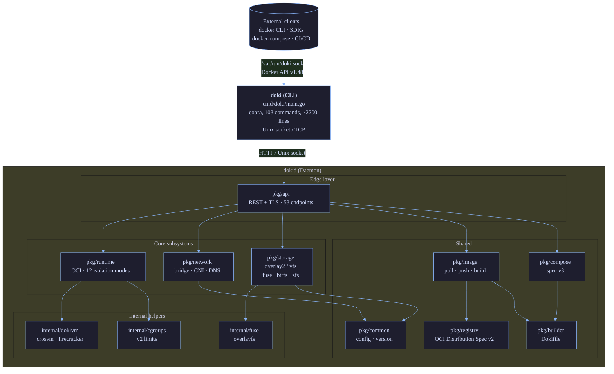
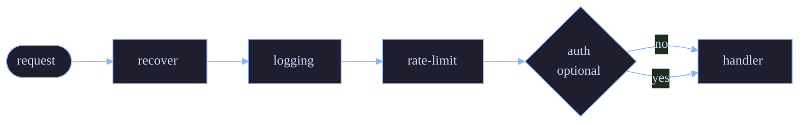

# Architecture

This page explains how Doki is structured internally. It complements the [README](../README.md#architecture) high-level overview with deeper detail for contributors and curious users.

## High-Level Diagram



## Subsystem Walkthrough

### 1. `pkg/api` — Docker Engine API v1.48

The daemon's public face. Implements 53 endpoints that match the Docker Engine API:

| Group | Endpoints | Source |
|:------|:----------|:-------|
| Containers | 16 | `pkg/api/containers.go` |
| Images | 8 | `pkg/api/images.go` |
| Networks | 6 | `pkg/api/networks.go` |
| Volumes | 4 | `pkg/api/volumes.go` |
| System | 6 | `pkg/api/system.go` |
| Exec | 3 | `pkg/api/exec.go` |
| Auth | 1 | `pkg/api/auth.go` |
| Other (events, info, version) | 9 | `pkg/api/misc.go` |

Built on top of `gorilla/mux` for routing and `net/http` stdlib. Middleware chain:



TLS is supported via `DOKI_TLS`/`DOKI_TLS_CERT`/`DOKI_TLS_KEY` env vars or `config.json` `tls` block. mTLS is supported with `tls.client_ca`.

### 2. `pkg/runtime` — OCI Runtime

Implements the [OCI Runtime Spec](https://github.com/opencontainers/runtime-spec). The `Runtime` struct holds:

```go
type Runtime struct {
    mu       sync.RWMutex
    root     string         // state root
    store    *storage.Manager
    nsMgr    *namespaces.Manager  // linux-only
    cgMgr    *cgroups.Manager     // linux-only
    prootMgr *proot.Manager       // fallback for Android
    rootless bool
    mode     ExecutionMode
    dnsAddr  string
}
```

When `Run(cfg)` is called, the pipeline is:

1. **Setup network** (`pkg/network.SetupNetwork`): create veth pair, attach to bridge, allocate IP, register DNS
2. **Pull image** (or use cached layers): via `pkg/registry` and `pkg/image`
3. **Extract rootfs**: tar with whiteout handling, path traversal protection
4. **Select runner**: `detectMode()` returns the best available from 12 levels
5. **Dispatch to runner**: `startProcess()` invokes the chosen runner
6. **Record state**: write `state.json` atomically
7. **Monitor**: wait for process exit, capture exit code, write logs

#### 12 Runners (auto-detection)

The `pkg/runtime/registry.go` probes for each:

| Priority | Mode | Probe |
|:---------|:-----|:------|
| 1 | pKVM/Microdroid | `/dev/kvm` readable + Android 15+ |
| 2 | MicroVM | `/dev/kvm` readable + `crosvm`/`firecracker` in `$PATH` |
| 3 | Sysbox | `sysbox-runc` in `$PATH` |
| 4 | Namespaces | `unshare` works |
| 5 | gVisor | `runsc` in `$PATH` |
| 6 | FEX-Emu | `FEXInterpreter` or `box64` in `$PATH` |
| 7 | QEMU User | `qemu-*-static` in `$PATH` |
| 8 | Proot | `proot` in `$PATH` (or shipped) |
| 9 | Legacy32 | `binfmt_misc` registered + multiarch qemu |
| 10 | Chroot | always |
| 11 | WASM | `wasmedge` or `iwasm` in `$PATH` |
| 12 | Native | always (fallback) |

Force a specific mode with `doki run --runtime <mode>`. The runner registry walks top-down and returns the first that passes its probe.

### 3. `pkg/network` — Container Networking

Implements bridge networking, CNI plugins, port mapping, and internal DNS.

#### Bridge (`doki0`)

- Default Linux bridge with `10.0.0.0/24` subnet (configurable)
- iptables rules for NAT (MASQUERADE on outbound) and DNAT (port forwarding)
- veth pairs: host-side `veth*`, container-side `eth0`
- v0.9.2: `Endpoint.VethHost`/`VethPeer` fields track names for proper teardown

#### DNS

- Listens on `127.0.0.11:53` (Linux) or `127.0.0.11:8053` (Android)
- LRU cache (1024 entries, 5 min TTL)
- A, AAAA, PTR records
- ndots:0 default in generated resolv.conf
- TCP retry on TC bit (RFC 5966)
- Registration via `SetupNetwork`, re-registration via `ReRegisterDNS` on daemon restart

#### CNI plugins

- bridge, host-local, portmap, macvlan, ipvlan, dhcp, vlan
- Plugin manager exists in `pkg/network/cni.go` (not fully wired — see [Known Limitations](../README.md#what-does-not-work-yet))

#### Rootless (pasta)

For users without root, the [pasta](https://passt.top/) utility provides TCP/UDP connectivity without TAP devices. Doki's `pkg/network/rootless.go` shells out to `pasta` for port forwarding.

### 4. `pkg/storage` — Storage Drivers

Five drivers, auto-detected by `DetectBestDriver()`:

| Driver | Use case | Code path |
|:-------|:---------|:----------|
| `overlay2` | Linux with kernel support | `syscall.Mount("overlay", ...)` |
| `fuse-overlayfs` | Rootless, Termux, Android | FUSE userspace mount |
| `btrfs` | Btrfs root filesystem | subvolumes + snapshots |
| `zfs` | ZFS pools | datasets + snapshots |
| `vfs` | Fallback (testing) | directory copy |

Content-addressable layer store: layers stored by SHA256 in `~/.doki/layers/`. Image metadata in `~/.doki/images/`. Container state in `~/.doki/containers/<id>/state.json`.

### 5. `pkg/image` — OCI Image Operations

- Pull: `Pull(ref)` calls `pkg/registry` for the manifest, then fetches each layer in parallel
- Push: `Push(ref)` uploads blobs (with cross-repo mount optimization), then puts the manifest
- Build: `Build(dokifile)` runs the 18-instruction Dokifile parser
- Inspect: `Inspect(ref)` returns OCI image config + manifest

### 6. `pkg/registry` — OCI Distribution Spec Client

Implements [OCI Distribution Spec v1.1](https://github.com/opencontainers/distribution-spec/blob/main/spec.md):

- `GET /v2/<name>/manifests/<reference>` — fetch manifest
- `HEAD /v2/<name>/manifests/<reference>` — check existence
- `GET /v2/<name>/blobs/<digest>` — fetch blob (with Range support for resumption)
- `POST /v2/<name>/blobs/uploads/` — initiate upload
- `PATCH /v2/<name>/blobs/uploads/<uuid>` — upload chunk
- `PUT /v2/<name>/blobs/uploads/<uuid>?digest=...` — finalize
- Cross-repo mount: try `?<mount=<digest>&from=<other-repo>` to avoid re-uploading
- Auth: Bearer token, Basic, with WWW-Authenticate challenge parsing

### 7. `pkg/compose` — Compose Engine

Parses Compose Spec v3 (most fields). Main entry point is `pkg/compose/compose.go`:

```go
type Project struct {
    Name     string
    Services map[string]*Service
    Networks map[string]*Network
    Volumes  map[string]*Volume
    Secrets  map[string]*Secret
}

func (p *Project) Up(ctx context.Context, opts UpOptions) error
func (p *Project) Down(ctx context.Context, opts DownOptions) error
func (p *Project) Ps(ctx context.Context) ([]ContainerStatus, error)
```

Depends on: `pkg/api` (talks to daemon), `pkg/common` (config).

### 8. `internal/dokivm` — MicroVM Subsystem

Wraps crosvm (Chromium OS Virtual Machine Monitor) and Firecracker. Provides:

- `crosvm.go` — crosvm launcher (used on Qualcomm/MediaTek/Samsung/Google chips with Gunyah/GenieZone/Halla/KVM)
- `firecracker.go` — Firecracker launcher (Intel/AMD servers)
- `qemu.go` — QEMU fallback when neither is available
- `kernel/` — prebuilt kernel + initrd at `kernels/`

### 9. `internal/fuse`, `internal/namespaces`, `internal/cgroups`, `internal/seccomp`, `internal/apparmor`

Linux-specific subsystems. `fuse` does overlayfs mounts (user-space alternative to kernel overlay). `namespaces` creates user/pid/net/mount/uts/ipc namespaces via `unshare`/`clone`. `cgroups` is v2 resource management. `seccomp` builds BPF filter programs. `apparmor` generates profile text.

On darwin, `internal/fuse/overlayfs_darwin.go` and `internal/namespaces/stub_darwin.go` are no-op stubs (added in v0.9.2).

### 10. `pkg/common` — Shared Code

- `common.Version`, `common.DokiVersion`, `common.DokiAPIVersion`, `common.GitCommit`, `common.BuildDate` — set via `-ldflags` at build time
- `common.StripHostEnv()` — filters `LD_PRELOAD`/`LD_LIBRARY_PATH`
- `common.Container` — the wire-level container struct
- `common.Image` — the wire-level image struct
- `common.Network`, `common.Volume`, `common.Port`, `common.Mount` — sub-types

## Concurrency Model

Doki's daemon is multi-goroutine but uses a single OS thread for I/O dispatch (`runtime.GOMAXPROCS(1)` is NOT set; it follows Go's default). Key synchronization points:

| Resource | Lock | Location |
|:---------|:-----|:---------|
| Container state | `sync.RWMutex` per container | `pkg/runtime/state.go` |
| DNS LRU cache | `sync.Mutex` | `pkg/network/dns.go` |
| Network registry | `sync.RWMutex` | `pkg/network/manager.go` |
| Storage layer cache | `sync.Map` | `pkg/storage/cache.go` |
| API rate limiter | `sync.Mutex` per IP | `pkg/api/ratelimit.go` |

Critical sections are short; long operations (extraction, network setup) happen outside the lock with copy-on-write semantics.

## Startup Sequence

`dokid` startup:

1. Load `~/.doki/config.json` (or platform default)
2. Initialize logger (`log/slog`, JSON or text based on stderr TTY)
3. Set up storage driver (`DetectBestDriver()`)
4. Initialize runtime, network, DNS subsystems
5. Load saved state from `state.json`
6. `recoverContainers`: for each saved container, re-register network endpoints and DNS entries
7. Start HTTP server on Unix socket (or TCP if configured)
8. Start DNS server on `DOKI_DNS_LISTEN`
9. Block on signal

## Why This Architecture?

Three principles drove the design:

1. **Drop-in Docker compatibility** — the API is 1:1 with Docker, so existing tooling (docker-py, dockerode, CI/CD pipelines) works without modification. This is why `pkg/api` is a separate subsystem and not a thin wrapper around an internal API.

2. **OCI compliance** — pull/push/runtime/build all use OCI specs. Doki can talk to any OCI registry, run any OCI image, and emit OCI runtime bundles.

3. **Resource constraints first** — Termux, Android, Raspberry Pi are the primary targets. Memory is precious, so the daemon idles at 12 MB and the CLI at 6.7 MB. This is why we use `log/slog` instead of zap/zerolog (slog is stdlib, no dependency), why we bundle proot detection, and why `fuse-overlayfs` is the default storage driver.

## Source Code Stats (v0.9.2)

- 40 Go source files (only counting `*.go` outside tests and generated files)
- 14,500+ lines of Go code
- 4 compiled binaries (`doki`, `dokid`, `doki-compose`, `doki-init`)
- 13 release binaries (4 binaries × 3 OS/arch + 1 darwin)
- 0 runtime CGo dependencies

## Next Steps

- [Isolation Levels](Isolation-Levels) — each of the 12 modes in detail
- [Networking](Networking) — bridge, CNI, DNS, iptables deep dive
- [Storage](Storage) — driver internals
- [Security](Security) — seccomp, capabilities, threat model
