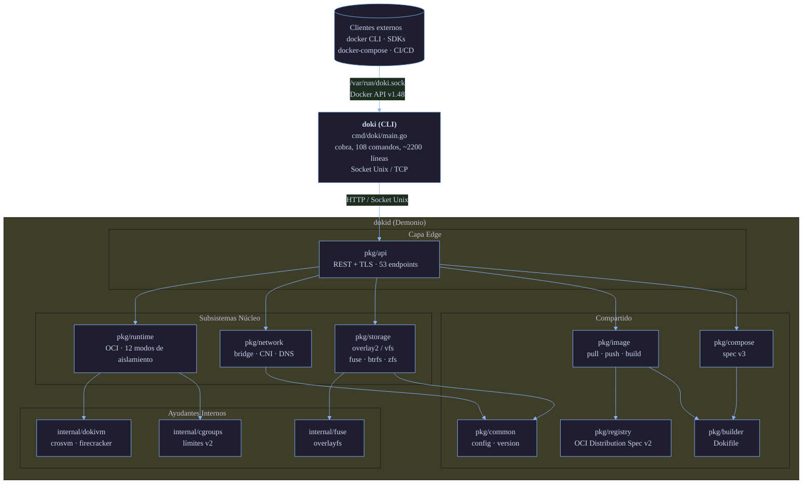
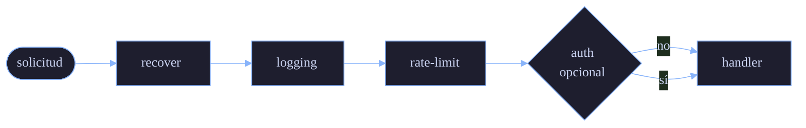

# Arquitectura

Esta página explica cómo está estructurado Doki internamente. Complementa la visión general de alto nivel del [README](../../README.md#architecture) con detalles más profundos para contribuyentes y usuarios curiosos.

## Diagrama de Alto Nivel



## Recorrido de Subsistemas

### 1. `pkg/api` — Docker Engine API v1.48

La cara pública del demonio. Implementa 53 endpoints que coinciden con la API Docker Engine:

| Grupo | Endpoints | Fuente |
|:------|:----------|:-------|
| Contenedores | 16 | `pkg/api/containers.go` |
| Imágenes | 8 | `pkg/api/images.go` |
| Redes | 6 | `pkg/api/networks.go` |
| Volúmenes | 4 | `pkg/api/volumes.go` |
| Sistema | 6 | `pkg/api/system.go` |
| Exec | 3 | `pkg/api/exec.go` |
| Auth | 1 | `pkg/api/auth.go` |
| Otros (events, info, version) | 9 | `pkg/api/misc.go` |

Construido sobre `gorilla/mux` para enrutamiento y `net/http` stdlib. Cadena de middleware:



TLS es compatible mediante variables de entorno `DOKI_TLS`/`DOKI_TLS_CERT`/`DOKI_TLS_KEY` o el bloque `tls` en `config.json`. mTLS es compatible con `tls.client_ca`.

### 2. `pkg/runtime` — OCI Runtime

Implementa el [OCI Runtime Spec](https://github.com/opencontainers/runtime-spec). La estructura `Runtime` contiene:

```go
type Runtime struct {
    mu       sync.RWMutex
    root     string             // raíz de estado
    store    *storage.Manager
    nsMgr    *namespaces.Manager   // solo linux
    cgMgr    *cgroups.Manager      // solo linux
    prootMgr *proot.Manager        // fallback para Android
    rootless bool
    mode     ExecutionMode
    dnsAddr  string
}
```

Cuando se llama a `Run(cfg)`, el pipeline es:

1. **Configurar red** (`pkg/network.SetupNetwork`): crear par veth, adjuntar al bridge, asignar IP, registrar DNS
2. **Descargar imagen** (o usar capas en caché): mediante `pkg/registry` y `pkg/image`
3. **Extraer rootfs**: tar con manejo de whiteout, protección de path traversal
4. **Seleccionar runner**: `detectMode()` devuelve el mejor disponible de 12 niveles
5. **Enviar al runner**: `startProcess()` invoca el runner elegido
6. **Registrar estado**: escribir `state.json` atómicamente
7. **Monitorear**: esperar la salida del proceso, capturar código de salida, escribir logs

#### 12 Runners (auto-detección)

`pkg/runtime/registry.go` sondea cada uno:

| Prioridad | Modo | Sonda |
|:----------|:-----|:------|
| 1 | pKVM/Microdroid | `/dev/kvm` legible + Android 15+ |
| 2 | MicroVM | `/dev/kvm` legible + `crosvm`/`firecracker` en `$PATH` |
| 3 | Sysbox | `sysbox-runc` en `$PATH` |
| 4 | Namespaces | `unshare` funciona |
| 5 | gVisor | `runsc` en `$PATH` |
| 6 | FEX-Emu | `FEXInterpreter` o `box64` en `$PATH` |
| 7 | QEMU User | `qemu-*-static` en `$PATH` |
| 8 | Proot | `proot` en `$PATH` (o incluido) |
| 9 | Legacy32 | `binfmt_misc` registrado + qemu multiarch |
| 10 | Chroot | siempre |
| 11 | WASM | `wasmedge` o `iwasm` en `$PATH` |
| 12 | Nativo | siempre (fallback) |

Fuerza un modo específico con `doki run --runtime <modo>`. El registro de runners recorre de arriba a abajo y devuelve el primero que pasa su sonda.

### 3. `pkg/network` — Redes de Contenedores

Implementa redes bridge, plugins CNI, mapeo de puertos y DNS interno.

#### Bridge (`doki0`)

- Bridge Linux predeterminado con subred `10.0.0.0/24` (configurable)
- Reglas iptables para NAT (MASQUERADE en salida) y DNAT (reenvío de puertos)
- Pares veth: lado host `veth*`, lado contenedor `eth0`
- v0.11.0: campos `Endpoint.VethHost`/`VethPeer` rastrean nombres para eliminación adecuada

#### DNS

- Escucha en `127.0.0.11:53` (Linux) o `127.0.0.11:8053` (Android)
- Caché LRU (1024 entradas, TTL 5 min)
- Registros A, AAAA, PTR
- ndots:0 predeterminado en resolv.conf generado
- Reintento TCP en bit TC (RFC 5966)
- Registro mediante `SetupNetwork`, re-registro mediante `ReRegisterDNS` al reiniciar el demonio

#### Plugins CNI

- bridge, host-local, portmap, macvlan, ipvlan, dhcp, vlan
- El gestor de plugins existe en `pkg/network/cni.go` (no completamente conectado — ver [Limitaciones Conocidas](../../README.md#what-does-not-work-yet))

#### Rootless (pasta)

Para usuarios sin root, la utilidad [pasta](https://passt.top/) proporciona conectividad TCP/UDP sin dispositivos TAP. `pkg/network/rootless.go` de Doki ejecuta `pasta` para el reenvío de puertos.

### 4. `pkg/storage` — Drivers de Almacenamiento

Cinco drivers, auto-detectados por `DetectBestDriver()`:

| Driver | Caso de uso | Ruta de código |
|:-------|:------------|:---------------|
| `overlay2` | Linux con soporte de kernel | `syscall.Mount("overlay", ...)` |
| `fuse-overlayfs` | Rootless, Termux, Android | Montaje FUSE en espacio de usuario |
| `btrfs` | Sistema de archivos raíz Btrfs | subvolúmenes + snapshots |
| `zfs` | Pools ZFS | datasets + snapshots |
| `vfs` | Fallback (pruebas) | copia de directorio |

Almacén de capas content-addressable: capas almacenadas por SHA256 en `~/.doki/layers/`. Metadatos de imágenes en `~/.doki/images/`. Estado del contenedor en `~/.doki/containers/<id>/state.json`.

### 5. `pkg/image` — Operaciones de Imagen OCI

- Pull: `Pull(ref)` llama a `pkg/registry` para el manifiesto, luego obtiene cada capa en paralelo
- Push: `Push(ref)` sube blobs (con optimización de montaje entre repositorios), luego pone el manifiesto
- Build: `Build(dokifile)` ejecuta el parser Dokifile de 18 instrucciones
- Inspect: `Inspect(ref)` devuelve la configuración de imagen OCI + manifiesto

### 6. `pkg/registry` — Cliente OCI Distribution Spec

Implementa [OCI Distribution Spec v1.1](https://github.com/opencontainers/distribution-spec/blob/main/spec.md):

- `GET /v2/<name>/manifests/<reference>` — obtener manifiesto
- `HEAD /v2/<name>/manifests/<reference>` — verificar existencia
- `GET /v2/<name>/blobs/<digest>` — obtener blob (con soporte Range para reanudación)
- `POST /v2/<name>/blobs/uploads/` — iniciar subida
- `PATCH /v2/<name>/blobs/uploads/<uuid>` — subir fragmento
- `PUT /v2/<name>/blobs/uploads/<uuid>?digest=...` — finalizar
- Montaje entre repositorios: intentar `?<mount=<digest>&from=<other-repo>` para evitar re-subir
- Auth: Bearer token, Basic, con análisis de desafío WWW-Authenticate

### 7. `pkg/compose` — Motor Compose

Analiza Compose Spec v3 (la mayoría de los campos). El punto de entrada principal es `pkg/compose/compose.go`:

```go
type Project struct {
    Name     string
    Services map[string]*Service
    Networks map[string]*Network
    Volumes  map[string]*Volume
    Secrets  map[string]*Secret
}

func (p *Project) Up(ctx context.Context, opts UpOptions) error
func (p *Project) Down(ctx context.Context, opts DownOptions) error
func (p *Project) Ps(ctx context.Context) ([]ContainerStatus, error)
```

Depende de: `pkg/api` (habla con el demonio), `pkg/common` (config).

### 8. `internal/dokivm` — Subsistema MicroVM

Envuelve crosvm (Chromium OS Virtual Machine Monitor) y Firecracker. Proporciona:

- `crosvm.go` — lanzador crosvm (usado en chips Qualcomm/MediaTek/Samsung/Google con Gunyah/GenieZone/Halla/KVM)
- `firecracker.go` — lanzador Firecracker (servidores Intel/AMD)
- `qemu.go` — fallback QEMU cuando ninguno está disponible
- `kernel/` — kernel precompilado + initrd en `kernels/`

### 9. `internal/fuse`, `internal/namespaces`, `internal/cgroups`, `internal/seccomp`, `internal/apparmor`

Subsistemas específicos de Linux. `fuse` hace montajes overlayfs (alternativa en espacio de usuario al overlay del kernel). `namespaces` crea namespaces user/pid/net/mount/uts/ipc mediante `unshare`/`clone`. `cgroups` es gestión de recursos v2. `seccomp` construye programas de filtro BPF. `apparmor` genera texto de perfil.

En darwin, `internal/fuse/overlayfs_darwin.go` y `internal/namespaces/stub_darwin.go` son stubs sin operación (agregados en v0.10.0).

### 10. `pkg/common` — Código Compartido

- `common.Version`, `common.DokiVersion`, `common.DokiAPIVersion`, `common.GitCommit`, `common.BuildDate` — establecidos mediante `-ldflags` en tiempo de compilación
- `common.StripHostEnv()` — filtra `LD_PRELOAD`/`LD_LIBRARY_PATH`
- `common.Container` — la estructura de contenedor a nivel de cable
- `common.Image` — la estructura de imagen a nivel de cable
- `common.Network`, `common.Volume`, `common.Port`, `common.Mount` — sub-tipos

## Modelo de Concurrencia

El demonio de Doki es multi-goroutine pero usa un solo hilo de SO para despacho de E/S (`runtime.GOMAXPROCS(1)` NO está establecido; sigue el valor predeterminado de Go). Puntos clave de sincronización:

| Recurso | Bloqueo | Ubicación |
|:--------|:--------|:----------|
| Estado del contenedor | `sync.RWMutex` por contenedor | `pkg/runtime/state.go` |
| Caché LRU DNS | `sync.Mutex` | `pkg/network/dns.go` |
| Registro de red | `sync.RWMutex` | `pkg/network/manager.go` |
| Caché de capa de almacenamiento | `sync.Map` | `pkg/storage/cache.go` |
| Limitador de tasa API | `sync.Mutex` por IP | `pkg/api/ratelimit.go` |

Las secciones críticas son cortas; las operaciones largas (extracción, configuración de red) ocurren fuera del bloqueo con semántica copy-on-write.

## Secuencia de Inicio

Inicio de `dokid`:

1. Cargar `~/.doki/config.json` (o predeterminado de la plataforma)
2. Inicializar logger (`log/slog`, JSON o texto según TTY de stderr)
3. Configurar driver de almacenamiento (`DetectBestDriver()`)
4. Inicializar subsistemas runtime, red, DNS
5. Cargar estado guardado de `state.json`
6. `recoverContainers`: para cada contenedor guardado, re-registrar endpoints de red y entradas DNS
7. Iniciar servidor HTTP en socket Unix (o TCP si está configurado)
8. Iniciar servidor DNS en `DOKI_DNS_LISTEN`
9. Bloquear en señal

## Por Qué Esta Arquitectura?

Tres principios guiaron el diseño:

1. **Compatibilidad directa con Docker** — la API es 1:1 con Docker, por lo que las herramientas existentes (docker-py, dockerode, pipelines CI/CD) funcionan sin modificación. Por eso `pkg/api` es un subsistema separado y no una capa delgada sobre una API interna.

2. **Cumplimiento OCI** — pull/push/runtime/build usan todos especificaciones OCI. Doki puede hablar con cualquier registro OCI, ejecutar cualquier imagen OCI y emitir bundles OCI runtime.

3. **Restricciones de recursos primero** — Termux, Android, Raspberry Pi son los objetivos principales. La memoria es valiosa, por lo que el demonio está inactivo en 12 MB y la CLI en 6.7 MB. Por eso usamos `log/slog` en lugar de zap/zerolog (slog es stdlib, sin dependencias), por qué agrupamos la detección de proot, y por qué `fuse-overlayfs` es el driver de almacenamiento predeterminado.

## Estadísticas de Código Fuente (v0.11.1)

- 158+ archivos fuente Go (solo contando `*.go` fuera de pruebas y archivos generados)
- 55,000+ líneas de código Go
- 6 binarios compilados (`doki`, `dokid`, `doki-compose`, `doki-init`, `doki-kube`, `doki-kubectl`)
- 30+ binarios de lanzamiento (6 binarios × 5 plataformas)
- 0 dependencias CGo en tiempo de ejecución (excepto backend macOS VZ)

## Próximos Pasos

- [Niveles de Aislamiento](Isolation-Levels) — cada uno de los 12 modos en detalle
- [Redes](Networking) — bridge, CNI, DNS, iptables en profundidad
- [Almacenamiento](Storage) — internos del driver
- [Seguridad](Security) — seccomp, capacidades, modelo de amenazas
