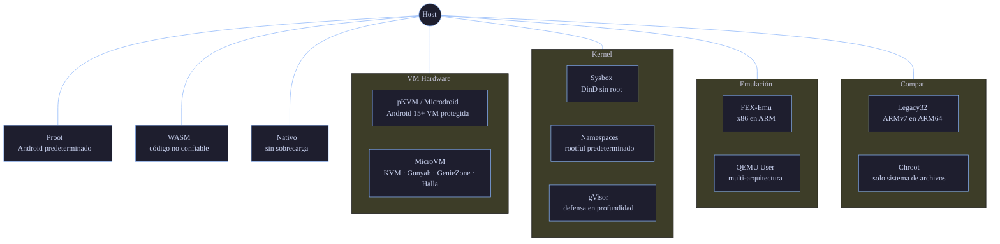

# Niveles de Aislamiento

Doki v0.11.1 soporta **12 niveles de aislamiento** — desde un sandbox WASM sin syscalls hasta microVMs a nivel de hardware. El registro de runners en `pkg/runtime/registry.go` sondea el host y elige el modo más fuerte que funciona. También puedes forzar un modo específico con `doki run --runtime <modo>`.

## Árbol de Decisión



## Tabla Resumen

| Nivel | Modo | Aislamiento | Sobrecarga | Caso de uso |
|:-----:|:-----|:------------|:-----------|:------------|
| 12 | WASM | Sandbox (user-space) | Mínima | Código no confiable, serverless, plugins |
| 11 | pKVM/Microdroid | Hardware (vm) | 5-20 MB RAM | Cómputo sensible en teléfonos/Chromebooks |
| 10 | MicroVM | Hardware (vm) | 5-20 MB RAM | Seguridad VM con velocidad de contenedor |
| 9 | Sysbox | Kernel (DinD) | Moderada | Docker-in-Docker, runners CI |
| 8 | Namespaces | Kernel | Insignificante | Multi-tenencia confiable en servidores |
| 7 | gVisor | Kernel user-space | ~20% CPU | Defensa en profundidad sin VM |
| 6 | FEX-Emu | Emulación (x86→ARM) | ~30% CPU | x86 legacy en Apple Silicon |
| 5 | QEMU User | Emulación (cross-arch) | ~50% CPU | Contenedores multi-arquitectura |
| 4 | Proot | Userspace (ptrace) | ~10% CPU | Android predeterminado, sin root |
| 3 | Legacy32 | Compat dual-arch | Insignificante | Contenedores ARMv7 en ARM64 |
| 2 | Chroot | Sistema de archivos | Mínima | Pruebas rápidas, etapas de build |
| 1 | Nativo | Ninguno | Cero | Carga de trabajo confiable, fallback |

## Cobertura Detallada

Cada nivel está implementado en `pkg/runtime/runners/<modo>/runner.go` (donde aplica) o directamente en `pkg/runtime/runtime.go` para los modos legacy.

### Nivel 12: WASM

**Qué es**: Ejecuta módulos WASI (WebAssembly System Interface) usando `wasmedge` o `iwasm` como runtime. El módulo nunca hace una syscall real — toda la E/S es mediada por el host WASM.

**Requisitos**:
- `wasmedge` o `iwasm` en `$PATH`
- Una imagen OCI con `mediatype: application/wasm`

**Casos de uso**:
- Código de usuario no confiable (plugins, webhooks)
- Funciones serverless
- Microservicios políglotas
- Cargas de trabajo sensibles a arranque en frío

**Rendimiento**: Sobrecarga mínima. Los módulos WASM compilan a código nativo al cargarse. Arranque en frío ~1-5ms.

**Compensaciones**:
- Superficie de syscall limitada (sin `fork`, `execve` real, etc.)
- Algunas bibliotecas (`os/exec` de Go, `child_process` de Node) no funcionan
- Redes requieren extensiones de socket WASI

**Estado**: No probado. La detección funciona, el runtime no validado en cargas de trabajo de producción.

### Nivel 11: pKVM / Microdroid

**Qué es**: Máquina Virtual Basada en Kernel Protegida, el hipervisor de Google en Android 15+. El kernel host se ejecuta en EL1, las VMs invitadas se ejecutan en un mundo protegido separado. La memoria está encriptada y aislada a nivel de hardware.

**Requisitos**:
- Dispositivo Android 15+ con kernel compatible con pKVM
- `/dev/kvm` legible
- `microdroid` disponible — Doki lo incluye

**Casos de uso**:
- Cómputo sensible en móvil (datos de salud, financieros)
- Multi-tenencia en ChromeOS
- Inferencia AI aislada en dispositivos edge

**Rendimiento**: Casi nativo. ~5-20 MB RAM de sobrecarga por invitado. Tiempo de arranque ~50ms.

**Estado**: No probado. La detección funciona, no hay hardware compatible disponible en CI.

### Nivel 10: MicroVM

**Qué es**: VMs ligeras mediante crosvm (Chromium OS VMM) o Firecracker (AWS). Arranca en microsegundos, expone un modelo de dispositivo mínimo.

**Casos de uso**:
- Serverless multi-tenencia (Firecracker en AWS Lambda)
- Cómputo edge con aislamiento fuerte
- Entornos de desarrollo que necesitan un kernel Linux "real"

**Rendimiento**: 5-20 MB RAM de sobrecarga. Tiempo de arranque ~5-50ms. Rendimiento de E/S dentro del 5% del nativo.

**Estado**: No probado. La detección funciona.

### Nivel 9: Sysbox

**Qué es**: [Sysbox](https://github.com/nestybox/sysbox) es un "runc runtime" que mejora los contenedores OCI con soporte de namespaces anidados. Permite ejecutar un demonio Docker completo dentro de un contenedor.

**Casos de uso**:
- Docker-in-Docker (runners CI, granjas de build)
- Kubernetes-in-Kubernetes
- CI/CD multi-etapa con operaciones privilegiadas

**Rendimiento**: Casi nativo para la mayoría de cargas de trabajo. ~5% de sobrecarga para operaciones de namespace anidado.

**Estado**: No probado. La detección funciona.

### Nivel 8: Namespaces

**Qué es**: Namespaces estándar de Linux — UTS, PID, IPC, Mount, Net, User, Cgroup. Esto es lo que Docker/Podman usan por defecto en modo rootful.

**Casos de uso**:
- Cargas de trabajo de servidor en producción
- Despliegues multi-tenencia confiables
- En cualquier lugar donde tengas root y quieras aislamiento nativo de contenedor

**Rendimiento**: Sobrecarga insignificante. <1% CPU, <0.5% memoria.

**Estado**: Probado.

### Nivel 7: gVisor

**Qué es**: [gVisor](https://gvisor.dev/) de Google es un kernel en espacio de usuario. El runtime `runsc` intercepta las syscalls en el contenedor y las reimplementa en Go. ~70% de las syscalls nunca llegan al kernel host.

**Casos de uso**:
- Multi-tenencia con código no confiable
- Defensa en profundidad
- Sandboxing de servicios de terceros

**Rendimiento**: ~20% de sobrecarga CPU. Sobrecarga de memoria mínima. Rendimiento de red ~70% del nativo.

**Estado**: No probado. La detección funciona.

### Nivel 6: FEX-Emu

**Qué es**: FEXInterpreter (o Box64) traduce binarios x86/x86_64 a ARM64 en tiempo de ejecución.

**Casos de uso**:
- Ejecutar contenedores x86 en Apple Silicon
- Aplicaciones x86 legacy en servidores ARM
- Desarrollo multi-arquitectura

**Rendimiento**: ~30% de sobrecarga CPU para cargas ligadas a cómputo. E/S casi nativa.

**Estado**: No probado. La detección funciona.

### Nivel 5: QEMU User

**Qué es**: Emulación en modo usuario de QEMU. Ejecuta binarios de una arquitectura diferente mediante `qemu-aarch64-static`, `qemu-x86_64-static`, etc.

**Casos de uso**:
- Desarrollo multi-arquitectura
- Ejecutar contenedores ARMv7 de 32 bits en ARM64
- Ejecutar contenedores ARM en servidores x86

**Rendimiento**: ~50% de sobrecarga CPU. El más lento de los modos emulados.

**Estado**: No probado. La detección funciona.

### Nivel 4: Proot

**Qué es**: [PRoot](https://proot-me.github.io/) es una implementación de `chroot`/`mount` en espacio de usuario que usa `ptrace` para interceptar syscalls. No requiere root.

**Casos de uso**:
- Runtime predeterminado en Android/Termux
- Servidores Linux sin root
- Pruebas de contenedores sin acceso root

**Rendimiento**: ~10% de sobrecarga CPU por ptrace. Sobrecarga de memoria mínima.

**Estado**: Probado en Termux/Android.

### Nivel 3: Legacy32

**Qué es**: Ejecuta contenedores ARMv7 en kernels ARM64 mediante `binfmt_misc` y soporte multiarquitectura.

**Casos de uso**:
- Ejecutar contenedores ARM de 32 bits en servidores ARM de 64 bits
- Compatibilidad con imágenes antiguas solo de 32 bits

**Rendimiento**: Sobrecarga insignificante con `binfmt_misc` configurado.

**Estado**: No probado. La detección funciona.

### Nivel 2: Chroot

**Qué es**: `chroot(2)` simple para aislamiento del sistema de archivos. Sin namespace PID, de red, ni de usuario.

**Casos de uso**:
- Aislamiento rápido de sistema de archivos para pruebas
- Etapas de build en CI

**Rendimiento**: Sobrecarga insignificante.

**Estado**: No probado.

### Nivel 1: Nativo

**Qué es**: Sin aislamiento. El contenedor es solo un directorio + variables de entorno.

**Casos de uso**:
- Cargas de trabajo confiables
- Fallback cuando nada más funciona

**Rendimiento**: Sin sobrecarga.

**Estado**: Probado.

## Forzar un Modo

```bash
# Forzar proot incluso si hay namespaces disponibles
doki run --runtime proot alpine echo hello

# Forzar microVM (fallará si no hay /dev/kvm)
doki run --runtime microvm alpine echo hello

# Listar modos disponibles
doki info --format json | jq '.Isolations'
```

## Niveles Futuros (planeados)

- **Landlock**: sandboxing a nivel de kernel sobre cualquier otro modo
- **Aislamiento io_uring**: anillo io_uring por contenedor con conjunto de operaciones restringido
- **Pase through GPU**: para cargas de trabajo AI/ML en microVM
- **Computación confidencial**: SEV-SNP / TDX en AMD/Intel, TrustZone en ARM

## Referencia

- Fuente: `pkg/runtime/registry.go`, `pkg/runtime/runners/*/`
- Lógica de decisión: `pkg/runtime/runtime.go:detectMode()`
- Fallback Proot: `pkg/runtime/runtime.go:retryWithQemu()`
- Auto-detección: `pkg/runtime/registry.go:hostPlatform()`
