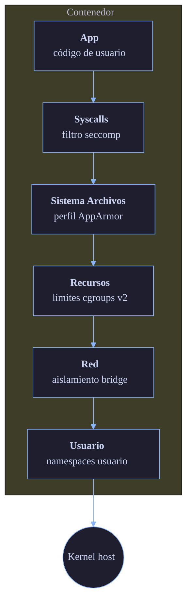

# Seguridad

Doki adopta un enfoque de defensa en profundidad: seccomp + AppArmor + capacidades + namespaces de usuario + TLS + verificación de imágenes + limitación de tasa. Desde v0.11.0, la aplicación de mTLS y la comparación en tiempo constante están habilitadas para despliegues en producción.

## Modelo de Amenazas

Doki está diseñado para estos escenarios de amenaza:

### Dentro del alcance

| Amenaza | Mitigación |
|:--------|:-----------|
| Escape de contenedor mediante exploit de kernel | Seccomp bloquea syscalls peligrosas |
| Contenedor leyendo datos de otros contenedores | Namespace de montaje + seccomp |
| Contenedor leyendo archivos del host | AppArmor + montajes de solo lectura |
| Sniffing de red | Aislamiento de bridge (sin modo promiscuo) |
| DoS mediante agotamiento de recursos | Límites cgroups v2 |
| Ataque a la cadena de suministro de imágenes | Protección path traversal, almacén content-addressable |
| Acceso no autorizado a la API | TLS + auth token + limitación de tasa |
| Imagen maliciosa con backdoor | Protección path traversal + validación de symlinks |

### Fuera del alcance

- Ataques de canal lateral (Spectre, Meltdown)
- Acceso físico al host
- Escapes de hipervisor (solo relevantes en modo MicroVM)
- Días cero de kernel (seccomp es una mitigación, no una solución)

## Capas



## Seccomp

Doki incluye un perfil seccomp predeterminado que permite ~80 syscalls y bloquea las peligrosas.

### Lista de permitidos predeterminada

Syscalls estándar: `read`, `write`, `open`, `openat`, `close`, `stat`, `fstat`, `mmap`, `mprotect`, `brk`, `rt_sigaction`, `rt_sigprocmask`, `rt_sigreturn`, `ioctl`, `pread64`, `pwrite64`, `readv`, `writev`, `access`, `pipe`, `select`, `pselect6`, `poll`, `ppoll`, `dup`, `dup2`, `dup3`, `socket`, `connect`, `accept`, `sendto`, `recvfrom`, `sendmsg`, `recvmsg`, `bind`, `listen`, `getsockname`, `getpeername`, `setsockopt`, `getsockopt`, `clone`, `fork`, `vfork`, `execve`, `exit`, `exit_group`, `wait4`, `waitid`, `kill`, `tkill`, `tgkill`, `getpid`, `gettid`, `getuid`, `getgid`, `geteuid`, `getegid`, `setuid`, `setgid`, `setreuid`, `setregid`, `setsid`, `getrlimit`, `prlimit64`, `getrusage`, `gettimeofday`, `clock_gettime`, `nanosleep`, `sched_yield`, `sched_getaffinity`, `munmap`, `mremap`, `msync`, `madvise`, `mincore`, `futex`, `getrandom`, `getcwd`, `chdir`, `mkdir`, `mkdirat`, `rmdir`, `unlink`, `unlinkat`, `rename`, `renameat`, `link`, `linkat`, `symlink`, `symlinkat`, `readlink`, `readlinkat`, `chmod`, `fchmod`, `fchmodat`, `chown`, `fchown`, `fchownat`, `fstatfs`, `statfs`, `umask`, `getpriority`, `setpriority`, `mount`, `umount2`, `unshare`, `setns`, `capget`, `capset`, `prctl`, `seccomp`, `personality`, `arch_prctl`, `time`, `set_tid_address`, `restart_syscall`, `exit`, `exit_group`

Syscalls modernas: `io_uring_setup`, `io_uring_enter`, `io_uring_register`, `pidfd_open`, `pidfd_send_signal`, `pidfd_getfd`, `rseq`, `userfaultfd`, `copy_file_range`, `landlock_create_ruleset`, `landlock_add_rule`, `landlock_restrict_self`, `memfd_create`, `close_range`, `faccessat2`, `process_mrelease`, `mseal`.

### Lista de denegados predeterminada

Las siguientes syscalls están explícitamente bloqueadas:

```
init_module, finit_module, delete_module      # Carga de módulos del kernel
kexec_load, kexec_file_load                   # Reemplazo de ejecución del kernel
iopl, ioperm                                  # Puertos de E/S hardware
kcmp                                          # Fugas de información del kernel
process_vm_readv, process_vm_writev           # Acceso a memoria entre procesos
bpf                                            # Carga de programas BPF
perf_event_open                                # Monitoreo de rendimiento
lookup_dcookie                                # Fugas de caché de dentry
quotactl                                       # Manipulación de cuotas
mount (con flags MS_REMOUNT|MS_BIND)         # Vector de escalación de privilegios
swapon, swapoff                                # Manipulación de swap
pivot_root                                     # Escape de chroot
reboot (con LINUX_REBOOT_CMD_KEXEC)          # Reinicio Kexec
```

### Perfil personalizado

Sobrescribe el predeterminado con una ruta de perfil personalizada:

```json
{
  "seccomp": {
    "profile": "/etc/doki/seccomp/custom.json"
  }
}
```

### Deshabilitar seccomp

```bash
doki run --security-opt seccomp=unconfined alpine echo hello
```

## AppArmor

AppArmor proporciona control de acceso obligatorio (MAC). Doki genera un perfil por contenedor.

## Capacidades

Por defecto, los contenedores se ejecutan con un conjunto mínimo de capacidades:

```
CHOWN, DAC_OVERRIDE, FSETID, FOWNER, MKNOD, NET_RAW, SETGID, SETUID, SETFCAP, SETPCAP, NET_BIND_SERVICE, SYS_CHROOT, KILL, AUDIT_WRITE
```

Elimina todas y agrega solo lo que necesitas:

```bash
doki run --cap-drop=ALL --cap-add=NET_BIND_SERVICE my-server:latest
```

## Namespaces de Usuario

Por defecto, el usuario root del contenedor (UID 0) se mapea a un UID alto en el host:

```json
{
  "uid_mappings": [{"container_id": 0, "host_id": 100000, "size": 65536}],
  "gid_mappings": [{"container_id": 0, "host_id": 100000, "size": 65536}]
}
```

## cgroups v2

Límites de recursos mediante cgroups v2 (solo Linux):

```bash
doki run -m 512m my-image
doki run --cpus 1.5 my-image
doki run --pids-limit 100 my-image
```

## TLS / mTLS

El demonio soporta TLS para conexiones de clientes:

```json
{
  "tls": {
    "cert": "/etc/doki/cert.pem",
    "key": "/etc/doki/key.pem",
    "client_ca": "/etc/doki/ca.pem",
    "verify": true
  }
}
```

## Limitación de Tasa

Limitador token-bucket por IP en la API:

```json
{
  "rate_limit": {
    "rps": 100,
    "burst": 200
  }
}
```

## Verificación de Imágenes

La extracción de imágenes de Doki tiene múltiples capas de verificación:

### Protección path traversal
### Validación de symlinks
### Restricciones de hardlinks
### Verificación de contenido

Cada capa SHA256 se verifica después de la descarga.

## Registro de Auditoría

El demonio registra todas las solicitudes API mediante `log/slog`:

```json
{
  "time": "2024-01-15T10:30:00Z",
  "level": "INFO",
  "msg": "request",
  "method": "POST",
  "path": "/containers/create",
  "remote": "127.0.0.1:54321",
  "duration_ms": 12,
  "status": 201
}
```

## Lista de Verificación de Endurecimiento

Para despliegues en producción:

- [ ] Habilita TLS en el socket del demonio (`DOKI_TLS=1`)
- [ ] Usa mTLS si expones la API a la red (`tls.verify: true`)
- [ ] Elimina todas las capacidades por defecto (`--cap-drop=ALL`), agrega solo lo necesario
- [ ] Usa modo rootless cuando sea posible
- [ ] Ejecuta con `--read-only` para contenedores estáticos
- [ ] Establece límites de memoria y CPU
- [ ] Establece `--pids-limit` para prevenir fork bombs
- [ ] Usa un perfil seccomp personalizado para cargas sensibles
- [ ] Usa un perfil AppArmor personalizado
- [ ] Fija digestos de imagen, no etiquetas (`myapp@sha256:abc...`)
- [ ] Habilita content trust (cuando esté disponible)
- [ ] Audita logs a un SIEM central
- [ ] Actualiza Doki regularmente

## Fuente

- `internal/seccomp/` — motor de perfil seccomp
- `internal/apparmor/` — generador de perfiles AppArmor
- `pkg/common/capabilities.go` — conjuntos de capacidades
- `pkg/storage/layer.go` — verificación de imágenes
- `pkg/api/auth.go` — configuración TLS
- `pkg/api/ratelimit.go` — limitación de tasa
- `cmd/dokid/main.go` — registro de solicitudes
