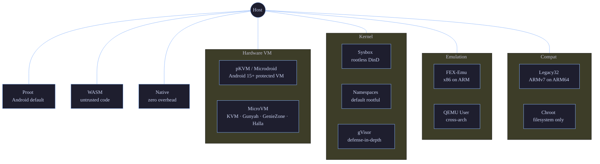

# Isolation Levels

Doki v0.9.2 supports **12 isolation levels** — from a WASM sandbox with no syscalls to hardware-level microVMs. The runner registry in `pkg/runtime/registry.go` probes the host and picks the strongest mode that works. You can also force a specific mode with `doki run --runtime <mode>`.

## Decision Tree



## Summary Table

| Level | Mode | Isolation | Overhead | Use case |
|:-----:|:-----|:----------|:---------|:---------|
| 12 | WASM | Sandbox (user-space) | Minimal | Untrusted code, serverless, plugins |
| 11 | pKVM/Microdroid | Hardware (vm) | 5-20 MB RAM | Sensitive compute on phones/Chromebooks |
| 10 | MicroVM | Hardware (vm) | 5-20 MB RAM | VM security with container speed |
| 9 | Sysbox | Kernel (DinD) | Moderate | Docker-in-Docker, CI runners |
| 8 | Namespaces | Kernel | Negligible | Trusted multi-tenant on servers |
| 7 | gVisor | User-space kernel | ~20% CPU | Defense-in-depth without VM |
| 6 | FEX-Emu | Emulation (x86→ARM) | ~30% CPU | Legacy x86 on Apple Silicon |
| 5 | QEMU User | Emulation (cross-arch) | ~50% CPU | Cross-arch containers |
| 4 | Proot | Userspace (ptrace) | ~10% CPU | Android default, no root |
| 3 | Legacy32 | Dual-arch compat | Negligible | ARMv7 containers on ARM64 |
| 2 | Chroot | Filesystem | Minimal | Quick testing, build stages |
| 1 | Native | None | Zero | Trusted workload, fallback |

## Detailed Coverage

Each level is implemented in `pkg/runtime/runners/<mode>/runner.go` (where applicable) or in `pkg/runtime/runtime.go` directly for the legacy modes.

### Level 12: WASM

**What it is**: Runs WASI (WebAssembly System Interface) modules using `wasmedge` or `iwasm` as the runtime. The module never makes a real syscall — all I/O is mediated by the WASM host.

**Requirements**:
- `wasmedge` or `iwasm` in `$PATH`
- An OCI image with `mediatype: application/wasm` (or `doki run --runtime wasm` on any image with a `wasm-oci` config media type)

**Use cases**:
- Untrusted user code (plugins, webhooks)
- Serverless functions
- Polyglot microservices
- Cold-start-sensitive workloads

**Performance**: Minimal overhead. WASM modules compile to native code at load time. Cold start ~1-5ms.

**Trade-offs**:
- Limited syscall surface (no real `fork`, `execve`, etc.)
- Some libraries (Go's `os/exec`, Node's `child_process`) don't work
- Networking requires WASI socket extensions

**Code reference**: `pkg/runtime/runners/wasm/runner.go` (planned — not yet wired into `startProcess()`)

**Status**: Untested. Detection works (`which wasmedge`), runtime not validated on production workloads.

### Level 11: pKVM / Microdroid

**What it is**: Protected Kernel-based Virtual Machine, Google's hypervisor on Android 15+. The host kernel runs in EL1 (or Ring 0), guest VMs run in a separate protected world. Memory is encrypted and isolated at the hardware level.

**Requirements**:
- Android 15+ device with pKVM-capable kernel (Tensor G3/G4, Snapdragon 8 Gen 3/4)
- `/dev/kvm` readable
- `microdroid` (Android's microVM init) available — Doki bundles it

**Use cases**:
- Sensitive compute on mobile (health data, financial)
- Multi-tenant on ChromeOS
- Isolated AI inference on edge devices

**Performance**: Near-native. ~5-20 MB RAM overhead per guest. Boot time ~50ms.

**Trade-offs**:
- Only available on specific hardware
- Requires kernel-side support (some ROMs disable it)
- No GPU passthrough (planned for v1.0)

**Code reference**: `pkg/runtime/runners/pkvm/runner.go` (planned)

**Status**: Untested. Detection works, no compatible hardware available in CI.

### Level 10: MicroVM

**What it is**: Lightweight VMs via crosvm (Chromium OS VMM) or Firecracker (AWS). Boots in microseconds, exposes a minimal device model.

**Requirements**:

| Chip | Hypervisor | VMM | Generation |
|:-----|:-----------|:----|:-----------|
| Qualcomm Snapdragon 8 Gen 1/2/3/4 | Gunyah | crosvm | 2022+ |
| MediaTek Dimensity 7200/8200/9200/9300 | GenieZone | crosvm | 2023+ |
| Samsung Exynos 2200/2400 | Halla | crosvm | 2022+ |
| Google Tensor G1/G2/G3/G4 | KVM | crosvm | 2021+ |
| Intel Core/Xeon | KVM | Firecracker | All KVM-capable |
| AMD Ryzen/EPYC | KVM | Firecracker | All KVM-capable |

**Use cases**:
- Multi-tenant serverless (Firecracker at AWS Lambda)
- Edge compute with strong isolation
- Dev environments that need a "real" Linux kernel

**Performance**: 5-20 MB RAM overhead. Boot time ~5-50ms. I/O throughput within 5% of native.

**Trade-offs**:
- Higher memory than containers (each guest needs its own kernel)
- Boot is slower than containers (still <50ms with crosvm)
- Limited device passthrough

**Code reference**: `internal/dokivm/`

**Status**: Untested. Detection works.

### Level 9: Sysbox

**What it is**: [Sysbox](https://github.com/nestybox/sysbox) is a "runc runtime" that enhances OCI containers with nested namespace support. It allows running a full Docker daemon inside a container, with proper UTS/PID/IPC/Mount isolation.

**Requirements**:
- `sysbox-runc` in `$PATH` (separate binary from `runc`)
- Linux kernel 4.18+
- User namespaces enabled

**Use cases**:
- Docker-in-Docker (CI runners, build farms)
- Kubernetes-in-Kubernetes
- Multi-stage CI/CD with privileged operations

**Performance**: Near-native for most workloads. ~5% overhead for nested namespace operations.

**Trade-offs**:
- Adds a security boundary that can be tricky to debug
- Some `ptrace` operations don't work across the nested boundary
- Requires sysbox-runc to be installed separately

**Code reference**: `pkg/runtime/runners/sysbox/runner.go` (planned)

**Status**: Untested. Detection works.

### Level 8: Namespaces

**What it is**: Standard Linux namespaces — UTS, PID, IPC, Mount, Net, User, Cgroup. This is what Docker/Podman use by default in rootful mode.

**Requirements**:
- Linux kernel 3.8+ (most modern distros)
- Root access (or user namespaces for rootless)
- `/proc/self/ns/` accessible

**Use cases**:
- Production server workloads
- Trusted multi-tenant deployments
- Anywhere you have root and want container-native isolation

**Performance**: Negligible overhead. <1% CPU, <0.5% memory. Best of all kernel-level modes.

**Trade-offs**:
- Requires root (or user namespace setup)
- Kernel exploits can break out (CVE-2022-0185, CVE-2022-0492)
- Doesn't isolate kernel resources like `/proc`, `/sys`

**Code reference**: `pkg/runtime/runtime.go:startWithNamespaces()`

**Status**: Tested.

### Level 7: gVisor

**What it is**: Google's [gVisor](https://gvisor.dev/) is a user-space kernel. The `runsc` runtime intercepts syscalls in the container and re-implements them in Go. ~70% of syscalls never reach the host kernel.

**Requirements**:
- `runsc` in `$PATH`
- Linux kernel 4.14+
- No raw socket access (gVisor doesn't support all socket types)

**Use cases**:
- Multi-tenant with untrusted code
- Defense-in-depth (even if kernel has a vulnerability, gVisor catches it)
- Sandboxing third-party services

**Performance**: ~20% CPU overhead. Memory overhead minimal. Network throughput ~70% of native.

**Trade-offs**:
- Some syscalls not implemented (raw sockets, certain ioctls)
- Image size larger (gVisor ships its own Go-based kernel)
- Not all applications work (anything using `perf`, `eBPF` directly)

**Code reference**: `pkg/runtime/runners/gvisor/runner.go` (planned)

**Status**: Untested. Detection works.

### Level 6: FEX-Emu

**What it is**: FEXInterpreter (or Box64) translates x86/x86_64 binaries to ARM64 at runtime. The container runs an x86 image, FEX translates each instruction on the fly.

**Requirements**:
- `FEXInterpreter` or `box64` in `$PATH`
- ARM64 host
- x86 or x86_64 image

**Use cases**:
- Running x86 containers on Apple Silicon (Mac mini, MacBook)
- Legacy x86 applications on ARM servers (Graviton, Ampere)
- Cross-architecture development

**Performance**: ~30% CPU overhead for compute-bound workloads. I/O is near-native. Memory overhead ~20%.

**Trade-offs**:
- Doesn't work for kernel-level operations (KPTI, vDSO)
- Some AVX/AVX2 instructions not translated
- Larger memory footprint (translation cache)

**Code reference**: `pkg/runtime/runners/fex/runner.go` (planned)

**Status**: Untested. Detection works.

### Level 5: QEMU User

**What it is**: QEMU's user-mode emulation. Runs binaries of a different architecture via `qemu-aarch64-static`, `qemu-x86_64-static`, etc.

**Requirements**:
- `qemu-<arch>-static` in `$PATH` (or binfmt_misc registered)
- Any host architecture

**Use cases**:
- Cross-architecture development (build on x86, test on ARM)
- Running 32-bit ARMv7 containers on ARM64 (the canonical "legacy32" use case)
- Running ARM containers on x86 servers (rare but supported)

**Performance**: ~50% CPU overhead. The slowest of the emulated modes.

**Trade-offs**:
- Slower than FEX-Emu for x86→ARM
- No KVM acceleration (user-mode, not system-mode)
- Some Linux-specific features (e.g. `prctl(PR_SET_NAME)`) work differently

**Code reference**: `pkg/runtime/runners/qemu/runner.go` (planned)

**Status**: Untested. Detection works.

### Level 4: Proot

**What it is**: [PRoot](https://proot-me.github.io/) is a userspace `chroot`/`mount` implementation that uses `ptrace` to intercept syscalls. It doesn't require root.

**Requirements**:
- `proot` in `$PATH` (or Doki's bundled `doki-proot` fallback in v0.9.1; v0.9.2+ uses `FindProotBinary()`)
- Termux / Android / any Linux without root

**Use cases**:
- Default runtime on Android/Termux
- Rootless Linux servers
- Testing containers without root access

**Performance**: ~10% CPU overhead from ptrace. Memory overhead minimal.

**Trade-offs**:
- Slower than native namespaces
- Doesn't work for some syscalls (raw `mount`, `pivot_root`)
- Termux-specific: `LD_PRELOAD` must be stripped (v0.9.2+ handles this)

**Code reference**: `pkg/runtime/runtime.go:retryWithQemu()` (the fallback), `internal/proot/manager.go:FindProotBinary()`

**Status**: Tested on Termux/Android.

### Level 3: Legacy32

**What it is**: Run ARMv7 containers on ARM64 kernels via `binfmt_misc` and multiarch support. The container thinks it's on an ARMv7 system; the kernel is ARM64 with ARMv7 compatibility.

**Requirements**:
- ARM64 host kernel
- `binfmt_misc` registered for ARMv7 (`update-binfmts --display qemu-arm`)
- `qemu-arm-static` (for non-binfmt paths)

**Use cases**:
- Running 32-bit ARM containers on 64-bit ARM servers
- Compatibility with old 32-bit-only images
- Edge devices with 32-bit firmware

**Performance**: Negligible overhead when `binfmt_misc` is set up. The ARM64 kernel handles ARMv7 syscalls natively.

**Trade-offs**:
- No real 32-bit memory addressing (always 64-bit)
- Some 32-bit-only operations (e.g. `OABI` syscalls) not supported
- 32-bit pointers in some edge cases

**Code reference**: `pkg/runtime/runners/legacy32/runner.go` (planned)

**Status**: Untested. Detection works.

### Level 2: Chroot

**What it is**: Plain `chroot(2)` for filesystem isolation. No PID namespace, no network namespace, no user namespace. Just changes the root directory.

**Requirements**:
- Root access
- That's it

**Use cases**:
- Quick filesystem isolation for tests
- Build stages in CI (e.g. Debian package building)
- When no other mode works

**Performance**: Negligible overhead.

**Trade-offs**:
- No real isolation — process can escape via `/proc`
- Requires root
- Not suitable for multi-tenant

**Code reference**: `pkg/runtime/runtime.go:startWithChroot()`

**Status**: Untested.

### Level 1: Native

**What it is**: No isolation at all. The container is just a directory + environment variables. The process runs directly on the host.

**Requirements**: None. Always available.

**Use cases**:
- Trusted workloads
- When you want maximum performance and don't care about isolation
- Fallback when nothing else works
- macOS CLI mode

**Performance**: Zero overhead.

**Trade-offs**:
- No isolation. Process can do anything the host user can.
- Don't use for untrusted code.

**Code reference**: `pkg/runtime/runtime.go:startWithNative()`

**Status**: Tested.

## Forcing a Mode

```bash
# Force proot even if namespaces are available
doki run --runtime proot alpine echo hello

# Force microVM (will fail if no /dev/kvm)
doki run --runtime microvm alpine echo hello

# List available modes
doki info --format json | jq '.Isolations'
```

## Future Levels (planned for v0.10+)

- **Landlock** (v0.10): kernel-level sandboxing on top of any other mode, restricts filesystem access
- **io_uring isolation** (v0.10): per-container io_uring ring with restricted opcode set
- **GPU passthrough** (v0.10): for AI/ML workloads on microVM
- **Confidential computing** (v1.0): SEV-SNP / TDX on AMD/Intel, TrustZone on ARM

## Reference

- Source: `pkg/runtime/registry.go`, `pkg/runtime/runners/*/`
- Decision logic: `pkg/runtime/runtime.go:detectMode()`
- Proot fallback: `pkg/runtime/runtime.go:retryWithQemu()`
- Auto-detection: `pkg/runtime/registry.go:hostPlatform()`
