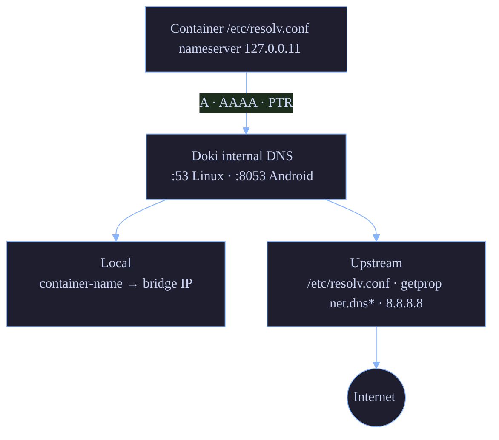

# Networking

Doki's networking stack provides bridge networks, CNI plugin support, port mapping, and an internal DNS server. The v0.9.2 release fixed several long-standing bugs in the iptables DNAT construction and veth teardown.

## Network Types

| Type | Description | Driver |
|:-----|:------------|:-------|
| **bridge** | Default `doki0` bridge with NAT, DNS, port mapping | Linux bridge + iptables |
| **host** | Share host network namespace | (no driver) |
| **none** | Loopback only | (no driver) |
| **overlay** | Multi-host (planned) | vxlan |
| **macvlan** | Direct host NIC access | macvlan |
| **ipvlan** | L3 isolation | ipvlan |

### Default Bridge: `doki0`

On first start, the daemon creates a Linux bridge named `doki0` with the following config:

| Property | Default |
|:---------|:--------|
| Subnet | `10.0.0.0/24` |
| Gateway | `10.0.0.1` |
| MTU | 1500 |
| IP allocation | Sequential (`.2`, `.3`, ...) |
| iptables | MASQUERADE on outbound, DNAT on port forward |

Override in `config.json`:

```json
{
  "network": {
    "bridge": "doki0",
    "default_subnet": "10.1.0.0/24",
    "mtu": 1500,
    "ipv6": false
  }
}
```

### Container Attachment

When a container is started with `--network bridge`, the daemon:

1. Creates a veth pair (`veth<random>` ↔ `eth0` inside container)
2. Attaches the host-side veth to `doki0`
3. Assigns an IP from the subnet
4. Sets up iptables rules
5. Registers the container name in the internal DNS

### Host Network

`--network host` skips the bridge and gives the container the host's network namespace. The container sees all host interfaces and IPs. No port mapping needed (`-p` is a no-op).

Performance is the best of all modes. Security: least isolated — the container can sniff all host traffic.

### None

`--network none` gives the container only `lo`. No external network. Useful for batch processing, security-sensitive workloads.

## Port Mapping

### Syntax

```bash
-p HOST_IP:HOST_PORT:CONTAINER_PORT/PROTOCOL
-p HOST_PORT:CONTAINER_PORT
-p CONTAINER_PORT   # random host port (use -P to publish all EXPOSE)
```

### Examples

```bash
# Map host 8080 to container 80
doki run -p 8080:80 nginx:alpine

# Bind to specific host IP
doki run -p 127.0.0.1:8080:80 nginx:alpine

# Multiple protocols
doki run -p 8080:80/tcp -p 8080:80/udp my-server:latest

# Publish all EXPOSEd ports
doki run -P nginx:alpine

# Port range
doki run -p 8080-8090:80 my-server:latest
```

### How it works (rootful)

1. `iptables -t nat -A DOKI -p tcp --dport 8080 -j DNAT --to-destination 10.0.0.2:80` (v0.9.2 fix)
2. `iptables -t nat -A POSTROUTING -s 10.0.0.2 -j MASQUERADE` (for return path)
3. `socat` for the actual TCP proxy in rootless mode

### v0.9.2 iptables DNAT fix

The DNAT rule construction in `pkg/network/manager.go` was using `strings.Split` and missing the `-A` (append) flag in v0.9.1:

```diff
- args := strings.Split("OUTPUT -p tcp --dport 8080 -j DNAT --to-destination 10.0.0.2:80", " ")
- exec.Command("iptables", args...).Run()  // error discarded
+ args := []string{
+     "-A", "OUTPUT",
+     "-p", "tcp",
+     "--dport", "8080",
+     "-j", "DNAT",
+     "--to-destination", "10.0.0.2:80",
+ }
+ out, err := exec.Command("iptables", args...).CombinedOutput()
+ if err != nil {
+     return fmt.Errorf("iptables DNAT: %s: %w", out, err)
+ }
```

Two things fixed:

1. **`-A` flag**: v0.9.1 had `OUTPUT` as the first arg, which iptables interpreted as the table name. The fix uses `[]string` and includes `-A` correctly.
2. **Error check**: v0.9.1 called `.Run()` and discarded the error. The fix uses `.CombinedOutput()` and wraps the error.

The DOKI chain is now also auto-created in `pkg/network/cni.go:ensureChains()` (idempotent — safe to call on every container start).

### v0.9.2 port-forwarding fix

The rootless `socat` proxy was connecting to `localhost:containerPort` instead of `containerIP:containerPort`:

```diff
- socatArgs := []string{
-     "TCP-LISTEN:8080,reuseaddr,fork",
-     "TCP:localhost:80",   // ← wrong: localhost from host ≠ container
- }
+ socatArgs := []string{
+     "TCP-LISTEN:8080,reuseaddr,fork",
+     "TCP:10.0.0.2:80",    // ← container bridge IP
+ }
```

### UDP support (v0.9.2)

UDP port forwarding is now supported via `socat -u`:

```go
if port.Type == "udp" {
    socatArgs = append(socatArgs[:2],
        append([]string{"UDP-LISTEN:8080,reuseaddr,fork"},
               "UDP:10.0.0.2:80")...)
}
```

## Internal DNS

Doki runs an internal DNS server that handles:

- Inter-container name resolution (`db` → `10.0.0.2`)
- A records (IPv4)
- AAAA records (IPv6)
- PTR records (reverse DNS)
- Forwarding to upstream resolvers

### Architecture



### Defaults (v0.9.2)

| Platform | Default listen | Why |
|:---------|:----------------|:----|
| Linux | `127.0.0.11:53` | Standard unprivileged port |
| Android (Termux) | `127.0.0.11:8053` | Port 53 blocked by SELinux |
| macOS | not used (ModeNative) | No bridge |

Override with `DOKI_DNS_LISTEN=IP:PORT`.

### Name Resolution

```bash
$ doki network create backend
$ doki run -d --name db --network backend postgres:alpine
$ doki run -d --name api --network backend my-api:latest

# From inside the api container:
$ doki exec api sh -c 'getent hosts db'
172.20.0.2      db.backend

# From the host (via the doki CLI):
$ doki network inspect backend
[
  {
    "Name": "backend",
    "Id": "abc123",
    "Containers": {
      "db": {"EndpointID": "...", "IPv4Address": "172.20.0.2"},
      "api": {"EndpointID": "...", "IPv4Address": "172.20.0.3"}
    }
  }
]
```

Aliases can be set with `doki network connect --alias db postgres backend`.

### LRU Cache

The DNS server has a built-in LRU cache:

- 1024 entries
- 5-minute TTL per entry
- Re-registered on container restart

### Key v0.9.2 fixes

| File | Bug | Fix |
|:-----|:----|:----|
| `pkg/network/dns.go` | Busy-wait on `SetReadDeadline` | `ReadFromUDP` blocks naturally |
| `pkg/common/resolv.go` | Stored `:port` in nameservers | Stripped, appended `:53` for dialling |
| `pkg/network/manager.go` | DNS not registered on container start | `SetupNetwork` calls `AddEntry` |
| `cmd/dokid/main.go` | Used `:53` on Android (blocked) | Uses `:8053` on Android |
| `pkg/network/dns.go` | No AAAA, no PTR | Added both |
| `pkg/common/resolv.go` | ndots:5 caused retry loops | ndots:0 default |
| `pkg/network/dns.go` | UDP-only | TCP retry on TC bit (RFC 5966) |
| `pkg/network/manager.go` | Lost DNS on daemon restart | `recoverContainers` calls `ReRegisterDNS` |

## CNI Plugins

CNI (Container Network Interface) is a spec for pluggable networking. Doki supports these plugins:

| Plugin | Purpose |
|:-------|:--------|
| `bridge` | Linux bridge (default) |
| `host-local` | Local IP allocation |
| `portmap` | Port mapping |
| `macvlan` | Direct host NIC access |
| `ipvlan` | L3 isolation |
| `dhcp` | DHCP-based IP allocation |
| `vlan` | 802.1Q VLAN tagging |

CNI is enabled with `DOKI_CNI=/path/to/cni/conf`. The default bridge mode doesn't use CNI directly (faster, no plugin overhead).

**Status**: Plugin manager exists, not fully wired into the runtime. See [Known Limitations](../README.md#what-does-not-work-yet).

## Rootless Networking (pasta)

For users without root, Doki uses [pasta](https://passt.top/) (the "pasta" tool, successor to slirp4netns). Pasta:

- TCP/UDP connectivity without root or TAP devices
- ICS (Internet Connection Sharing) mode
- Built-in DHCP server for the container
- Bind mounts work normally

Usage:

```bash
# pasta is auto-detected in $PATH
# or set DOKI_PASTA=/path/to/pasta
doki run --rm --network bridge alpine ping -c 1 8.8.8.8
```

Pasta listens on the host's external interface and NATs traffic for the container. Performance is ~95% of native (vs 70% for slirp4netns).

## IPv6

Enable on the default bridge:

```json
{
  "network": {
    "ipv6": true
  }
}
```

Or create an IPv6 network explicitly:

```bash
doki network create --ipv6 --subnet fd00::/64 ipv6-net
```

Doki assigns both v4 and v6 addresses when `ipv6: true`.

## Veth Teardown (v0.9.2 fix)

When a container is removed, its veth pair must be deleted to avoid leaking interfaces on the host. v0.9.2 added tracking:

```go
// pkg/network/manager.go
type Endpoint struct {
    // ...existing fields...
    VethHost string  // host-side interface name (e.g. "vethabc123")
    VethPeer string  // container-side interface name (e.g. "eth0")
}
```

`teardownBridgeNetwork()` now does:

```go
// Delete both veth ends
exec.Command("ip", "link", "del", endpoint.VethHost).Run()
// (VethPeer goes away automatically with the pair)

// Then delete the bridge
exec.Command("ip", "link", "del", bridgeName).Run()
```

Before v0.9.2: `ip link` would show dozens of `veth*` interfaces after running a few containers.

## Security Considerations

| Concern | Mitigation |
|:--------|:-----------|
| Container sniffing host traffic | Use `--network bridge` (default), not `host` |
| Container escaping via iptables manipulation | DOKI chain is namespaced, separate from system rules |
| DNS spoofing | DNS responses are bound to the container's IP |
| Port hijacking | First container to claim a host port wins; second fails with EADDRINUSE |
| ARP spoofing | Doki enables `arp_ignore`/`arp_announce` on veth interfaces |

## Performance

| Mode | Throughput | Latency overhead |
|:-----|:-----------|:-----------------|
| `bridge` (rootful) | 95% native | <0.1ms |
| `bridge` (rootless, pasta) | 90% native | ~0.2ms |
| `host` | 100% native | 0ms |
| `none` | (no network) | n/a |

## Source

- `pkg/network/manager.go` — bridge, port forwarding, veth, teardown
- `pkg/network/cni.go` — CNI plugin manager, DOKI chain
- `pkg/network/dns.go` — internal DNS server
- `pkg/network/android_dns.go` — Android DNS discovery
- `pkg/network/rootless.go` — pasta integration
- `pkg/common/resolv.go` — resolv.conf parsing
