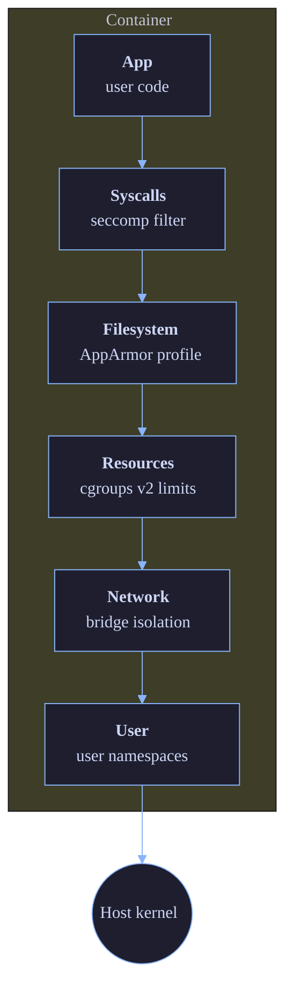

# Security

Doki takes a defense-in-depth approach: seccomp + AppArmor + capabilities + user namespaces + TLS + image verification + rate limiting. The v0.9.2 release didn't add new security features but fixed several regression-level bugs in the underlying stack.

## Threat Model

Doki is designed for these threat scenarios:

### In scope

| Threat | Mitigation |
|:-------|:-----------|
| Container escape via kernel exploit | Seccomp blocks dangerous syscalls |
| Container reading other containers' data | Mount namespace + seccomp |
| Container reading host files | AppArmor + read-only mounts |
| Network sniffing | Bridge isolation (no promiscuous mode by default) |
| Container DoS via resource exhaustion | cgroups v2 limits |
| Image supply chain attack | Path traversal protection, content-addressable store |
| Unauthorized API access | TLS + token auth + rate limiting |
| Malicious image with backdoor | Path traversal protection + symlink validation |

### Out of scope

- Side-channel attacks (Spectre, Meltdown) — kernel-level
- Physical access to the host
- Hypervisor escapes (only relevant for MicroVM mode)
- Kernel 0-days (seccomp is a mitigation, not a fix)

## Layers



## Seccomp

Doki ships with a default seccomp profile that allows ~80 syscalls and blocks the dangerous ones.

### Default allow list

Standard syscalls: `read`, `write`, `open`, `openat`, `close`, `stat`, `fstat`, `mmap`, `mprotect`, `brk`, `rt_sigaction`, `rt_sigprocmask`, `rt_sigreturn`, `ioctl`, `pread64`, `pwrite64`, `readv`, `writev`, `access`, `pipe`, `select`, `pselect6`, `poll`, `ppoll`, `dup`, `dup2`, `dup3`, `socket`, `connect`, `accept`, `sendto`, `recvfrom`, `sendmsg`, `recvmsg`, `bind`, `listen`, `getsockname`, `getpeername`, `setsockopt`, `getsockopt`, `clone`, `fork`, `vfork`, `execve`, `exit`, `exit_group`, `wait4`, `waitid`, `kill`, `tkill`, `tgkill`, `getpid`, `gettid`, `getuid`, `getgid`, `geteuid`, `getegid`, `setuid`, `setgid`, `setreuid`, `setregid`, `setsid`, `getrlimit`, `prlimit64`, `getrusage`, `gettimeofday`, `clock_gettime`, `nanosleep`, `sched_yield`, `sched_getaffinity`, `munmap`, `mremap`, `msync`, `madvise`, `mincore`, `futex`, `getrandom`, `getcwd`, `chdir`, `mkdir`, `mkdirat`, `rmdir`, `unlink`, `unlinkat`, `rename`, `renameat`, `link`, `linkat`, `symlink`, `symlinkat`, `readlink`, `readlinkat`, `chmod`, `fchmod`, `fchmodat`, `chown`, `fchown`, `fchownat`, `fstatfs`, `statfs`, `umask`, `getpriority`, `setpriority`, `getpriority`, `reboot` (kexec_load blocked, but reboot is allowed for shutdown), `mount`, `umount2`, `unshare`, `setns`, `capget`, `capset`, `prctl`, `seccomp`, `personality`, `arch_prctl`, `time`, `set_tid_address`, `restart_syscall`, `exit`, `exit_group`

Modern syscalls: `io_uring_setup`, `io_uring_enter`, `io_uring_register`, `pidfd_open`, `pidfd_send_signal`, `pidfd_getfd`, `rseq`, `userfaultfd`, `copy_file_range`, `landlock_create_ruleset`, `landlock_add_rule`, `landlock_restrict_self`, `memfd_create`, `close_range`, `faccessat2`, `process_mrelease`, `mseal`.

### Default deny list

The following syscalls are explicitly blocked, even with the default profile:

```
init_module, finit_module, delete_module      # Kernel module loading
kexec_load, kexec_file_load                   # Kernel execution replacement
iopl, ioperm                                  # Hardware I/O ports
kcmp                                          # Kernel info leaks (cross-PID)
process_vm_readv, process_vm_writev           # Cross-process memory access
bpf                                            # BPF program loading
perf_event_open                                # Performance monitoring
lookup_dcookie                                # dentry cache info leaks
quotactl                                       # Filesystem quota manipulation
mount (with MS_REMOUNT|MS_BIND flags)         # Privilege escalation vector
swapon, swapoff                                # Swap manipulation
pivot_root                                     # Chroot escape
reboot (with LINUX_REBOOT_CMD_KEXEC)          # Kexec-reboot
```

### Custom profile

Override the default with a custom profile path:

```json
{
  "seccomp": {
    "profile": "/etc/doki/seccomp/custom.json"
  }
}
```

Profile format is the [OCI runtime spec seccomp schema](https://github.com/opencontainers/runtime-spec/blob/main/config-linux.md#seccomp):

```json
{
  "defaultAction": "SCMP_ACT_ERRNO",
  "architectures": ["SCMP_ARCH_X86_64", "SCMP_ARCH_AARCH64"],
  "syscalls": [
    {
      "names": ["read", "write", "open", "close"],
      "action": "SCMP_ACT_ALLOW"
    }
  ]
}
```

### Disable seccomp

For testing or compatibility with unusual workloads:

```bash
doki run --security-opt seccomp=unconfined alpine echo hello
```

## AppArmor

AppArmor provides mandatory access control (MAC) on top of discretionary access control (DAC). Doki generates a profile per container.

### Default profile

```c
#include <tunables/global>

profile doki-default flags=(attach_disconnected,mediate_deleted) {
  #include <abstractions/base>
  #include <abstractions/nameservice>

  # Deny kernel module loading
  deny capability sys_module,
  # Deny raw I/O
  deny capability sys_rawio,

  # Allow network
  network inet stream,
  network inet6 stream,

  # Deny mount
  deny mount,
  deny umount,

  # Allow /docker/...
  /docker/** rwk,
  # Deny everything else
  deny /** w,
  deny /** a,
}
```

### Custom profile

```bash
doki run --security-opt apparmor=my-profile alpine echo hello
```

The profile `my-profile` must be loaded in the kernel (`apparmor_parser -a my-profile`).

## Capabilities

By default, containers run with a minimal capability set:

```
CHOWN, DAC_OVERRIDE, FSETID, FOWNER, MKNOD, NET_RAW, SETGID, SETUID, SETFCAP, SETPCAP, NET_BIND_SERVICE, SYS_CHROOT, KILL, AUDIT_WRITE
```

Drop all and add only what you need:

```bash
doki run --cap-drop=ALL --cap-add=NET_BIND_SERVICE my-server:latest
```

Common capability sets:

| Use case | Capabilities to add |
|:---------|:---------------------|
| Web server binding to port 80 | `NET_BIND_SERVICE` |
| Time server | `SYS_TIME` |
| NFS client | `SYS_ADMIN` (carefully) |
| Ping | `NET_RAW` |
| Tracing/debug | `SYS_PTRACE` (very dangerous) |

## User Namespaces

By default, the container's root user (UID 0) is mapped to a high UID on the host:

```json
{
  "uid_mappings": [{"container_id": 0, "host_id": 100000, "size": 65536}],
  "gid_mappings": [{"container_id": 0, "host_id": 100000, "size": 65536}]
}
```

This means even if the container escapes, it appears as UID 100000 on the host — no root access.

Disable with `--userns=host` (not recommended):

```bash
doki run --userns=host --rm alpine whoami
root  # ← dangerous: actual root on the host
```

## cgroups v2

Resource limits via cgroups v2 (Linux only):

```bash
# Memory limit
doki run -m 512m my-image

# CPU limit
doki run --cpus 1.5 my-image

# PIDs limit
doki run --pids-limit 100 my-image

# Block I/O weight
doki run --blkio-weight 500 my-image
```

Cgroups v2 unified hierarchy is required. On older distros:

```bash
# Enable cgroup v2
grubby --update-kernel=/boot/vmlinuz-$(uname -r) --args="systemd.unified_cgroup_hierarchy=1"
```

## TLS / mTLS

The daemon supports TLS for client connections:

```json
{
  "tls": {
    "cert": "/etc/doki/cert.pem",
    "key": "/etc/doki/key.pem",
    "client_ca": "/etc/doki/ca.pem",
    "verify": true
  }
}
```

With `verify: true` (mTLS), the daemon requires clients to present a certificate signed by `client_ca`. The Docker CLI and SDKs handle this via `DOCKER_CERT_PATH` or `DOKI_TLS_*` env vars.

Generate self-signed certs for testing:

```bash
openssl req -x509 -newkey rsa:4096 -keyout key.pem -out cert.pem -days 365 -nodes
```

For production, use a real CA (Let's Encrypt, internal PKI, etc.).

## Rate Limiting

Per-IP token-bucket rate limiter on the API:

```json
{
  "rate_limit": {
    "rps": 100,
    "burst": 200
  }
}
```

100 requests per second sustained, with bursts up to 200. Exceeding this returns HTTP 429.

## Image Verification

Doki's image extraction has multiple layers of verification:

### Path traversal protection

```go
// pkg/storage/layer.go
if strings.Contains(path, "..") {
    return fmt.Errorf("path traversal: %s", path)
}
if filepath.IsAbs(path) {
    return fmt.Errorf("absolute path: %s", path)
}
```

### Symlink validation

```go
// If a symlink target points outside the rootfs, reject it
realPath, err := filepath.EvalSymlinks(target)
if !strings.HasPrefix(realPath, rootfsDir) {
    return fmt.Errorf("symlink escape: %s -> %s", target, realPath)
}
```

### Hardlink restrictions

Hardlinks must point within the same layer (not across layers). Prevents an attacker from hardlinking a sensitive file from a lower layer into a writable upper dir.

### Content verification

Each layer's SHA256 is verified after download. If the registry returns a layer with a different digest, the download is rejected.

## Image Signing (planned)

Doki plans to support [cosign](https://github.com/sigstore/cosign) signatures for v1.0:

```bash
# Sign an image
cosign sign --key cosign.key myapp:1.0

# Doki will verify on pull
doki pull myapp:1.0
INFO  verifying signature for myapp:1.0
INFO  signature valid (key: <fingerprint>)
```

## Audit Logging

The daemon logs all API requests via `log/slog`:

```json
{
  "time": "2024-01-15T10:30:00Z",
  "level": "INFO",
  "msg": "request",
  "method": "POST",
  "path": "/containers/create",
  "remote": "127.0.0.1:54321",
  "duration_ms": 12,
  "status": 201
}
```

In JSON mode (production), this is greppable and parseable. Pipe to your SIEM.

## Container Logs

Containers' stdout/stderr are written to `data/containers/<id>/logs/*.log` by default. With `--log-driver journald`, they go to systemd's journal. With `--log-driver local`, they use a binary format with rotation.

Log rotation: `log_opts.max-size=10m`, `log_opts.max-file=3` (10 MB × 3 files = 30 MB max per container).

## Security Advisories

Security issues should be reported to security@doki.opceanai.com (PGP key on the website). We follow a 90-day disclosure timeline.

## Hardening Checklist

For production deployments:

- [ ] Enable TLS on the daemon socket (`DOKI_TLS=1`)
- [ ] Use mTLS if exposing the API to the network (`tls.verify: true`)
- [ ] Drop all capabilities by default (`--cap-drop=ALL`), add only what's needed
- [ ] Use rootless mode where possible
- [ ] Run with `--read-only` for static containers
- [ ] Set memory and CPU limits
- [ ] Set `--pids-limit` to prevent fork bombs
- [ ] Use a custom seccomp profile for sensitive workloads
- [ ] Use a custom AppArmor profile
- [ ] Pin image digests, not tags (`myapp@sha256:abc...`)
- [ ] Enable content trust (when available)
- [ ] Audit logs to a central SIEM
- [ ] Update Doki regularly (security patches in point releases)

## Source

- `internal/seccomp/` — seccomp profile engine
- `internal/apparmor/` — AppArmor profile generator
- `pkg/common/capabilities.go` — capability sets
- `pkg/storage/layer.go` — image verification
- `pkg/api/auth.go` — TLS configuration
- `pkg/api/ratelimit.go` — rate limiting
- `cmd/dokid/main.go` — request logging
