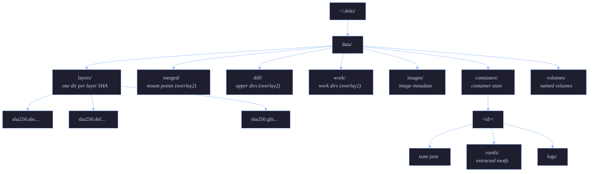

# Storage

Doki supports 5 storage drivers, auto-detected by `DetectBestDriver()`. The driver chosen depends on your kernel, filesystem, and whether you have root.

## Driver Comparison

| Driver | Use case | Root required | Performance | Status |
|:-------|:---------|:--------------|:------------|:-------|
| `overlay2` | Linux servers with kernel overlay | Yes (for mount) | Best (native kernel) | Tested |
| `fuse-overlayfs` | Rootless, Termux, Android | No | ~90% of overlay2 | Tested |
| `btrfs` | Systems with btrfs root | No (subvolumes) | Best (with snapshots) | Untested |
| `zfs` | Systems with ZFS pools | No (datasets) | Best (with snapshots) | Untested |
| `vfs` | Fallback, testing | No | Slowest (copy on read) | Tested |

## Auto-detection

```go
// pkg/storage/driver.go
func DetectBestDriver(root string) string {
    if canUseOverlay2() {  // modprobe overlay OR /proc/filesystems has overlay
        return DriverOverlay2
    }
    if isBtrfs(root) {     // stat -f -c %T returns btrfs
        return "btrfs"
    }
    if _, err := exec.LookPath("zfs"); err == nil {
        return "zfs"
    }
    return "fuse-overlayfs"  // always works
}
```

On Linux with root: `overlay2`. On Termux: `fuse-overlayfs`. On macOS: `vfs`. On Btrfs root: `btrfs`. Override with `DOKI_STORAGE_DRIVER=<driver>` or `storage_driver` in `config.json`.

## Content-Addressable Store

All layers are stored by SHA256 hash in a content-addressable store:



Pulled layers are deduplicated automatically — if two images share a base layer, it's stored once.

## Layer Extraction

When `doki pull alpine` runs:

1. **Fetch manifest** — `pkg/registry` calls `GET /v2/alpine/manifests/latest`
2. **Parse config** — extract the layer list and image config
3. **Download layers in parallel** — 4 concurrent downloads, with Range support for resumption
4. **Verify checksums** — SHA256 each blob after download
5. **Store in CAS** — each layer goes to `data/layers/sha256:<digest>/`
6. **Extract on demand** — when a container is started, layers are stacked into `data/containers/<id>/rootfs/`

Extraction is Go-native (no `tar` binary needed):

- Detects compression: gzip, bzip2, xz, zstd (auto)
- Path traversal protection: rejects `..`, absolute paths
- Symlink validation: rejects symlinks pointing outside the rootfs
- Hardlink restrictions: hardlinks only within the same layer
- Whiteout handling: `.wh.` prefix removes files from lower layers
- Parallel extraction with rollback on error

## Driver Details

### overlay2

The fastest driver. Uses the Linux kernel's `overlayfs` mount syscall.

**Requirements**:
- Linux kernel 3.18+ (4.0+ recommended)
- `CONFIG_OVERLAY_FS=y` in kernel
- Root access (for the mount syscall)

**Mount**:
```go
opts := fmt.Sprintf("lowerdir=%s,upperdir=%s,workdir=%s", lowerDir, upperDir, workDir)
syscall.Mount("overlay", mergeDir, "overlay", 0, opts)
```

**Backing filesystem**: must support extended attributes. Most filesystems do, but some FUSE filesystems don't.

**Quota**: Btrfs, XFS (with project quotas), ZFS, and ext4 (with project quotas) support per-container disk quotas.

### fuse-overlayfs

The rootless alternative. Userspace overlay via FUSE.

**Requirements**:
- `fuse-overlayfs` binary in `$PATH` (or `apt install fuse-overlayfs` / `pkg install fuse-overlayfs` on Termux)
- FUSE kernel module (or `fusermount`)

**Performance**: ~90% of kernel overlay2. The FUSE overhead is mostly in metadata operations; data reads/writes are near-native.

**Usage on Termux** (default):
```bash
$ pkg install fuse-overlayfs
$ doki run --rm alpine echo hello
```

### btrfs

Uses Btrfs subvolumes and snapshots.

**Requirements**:
- Btrfs root filesystem (or a Btrfs subvolume at the data root)
- `btrfs` CLI tools

**Advantages**:
- Snapshots are instant (CoW)
- Quotas work natively (`btrfs qgroup limit`)
- Send/receive for backups

**Setup**:
```bash
# Create a subvolume for Doki
btrfs subvolume create /var/lib/doki
# Configure Doki
echo '{"storage_driver": "btrfs"}' > /etc/doki/config.json
```

### zfs

Uses ZFS datasets and snapshots.

**Requirements**:
- ZFS pool mounted
- `zfs` CLI tools
- Linux: `zfs-dkms` or `zfsutils-linux`

**Advantages**:
- Snapshots and clones
- Native encryption
- Compression (lz4, zstd)
- Send/receive

**Setup**:
```bash
# Create a dataset for Doki
zfs create -o mountpoint=/var/lib/doki tank/doki
# Configure Doki
echo '{"storage_driver": "zfs"}' > /etc/doki/config.json
```

### vfs

Simple directory copy. No overlay, no snapshots.

**Use case**:
- Testing
- macOS (only option for now)
- Systems without overlay support

**Performance**: Worst of the bunch. Each `doki run` copies the entire image. Container start time is proportional to image size.

**Storage cost**: Higher than overlay (no CoW). Each container has its own complete copy.

## Volumes

Named volumes are stored separately from the container rootfs:

```bash
$ doki volume create db-data
db-data
$ doki run -d -v db-data:/var/lib/postgresql/data postgres:alpine
```

Volume data survives container removal. Anonymous volumes (created by `VOLUME` in Dockerfile) are removed with the container unless `-v` is passed to `doki rm`.

### Volume Drivers

| Driver | Backing |
|:-------|:--------|
| `local` | Local directory in `data/volumes/<name>/` |
| `tmpfs` | RAM-backed (Linux only) |
| `nfs` | NFS mount (requires `nfs-utils`) |

### tmpfs Volumes

```bash
$ doki run -d --tmpfs /tmp:size=64m,mode=1777 my-image:latest
$ doki run -d --mount type=tmpfs,destination=/tmp,tmpfs-size=67108864 my-image:latest
```

### NFS Volumes

```bash
$ doki volume create --driver local \
  --opt type=nfs \
  --opt o=addr=10.0.0.1,rw \
  --opt device=:/path/to/export \
  nfs-vol

$ doki run -d -v nfs-vol:/data my-image:latest
```

## Image Cache

Doki caches pulled images in the content-addressable store. To free space:

```bash
# Show disk usage
$ doki system df
TYPE            TOTAL     ACTIVE    SIZE      RECLAIMABLE
Images          5         3         1.2 GB    800 MB (66%)
Containers      10        2         50 MB     40 MB (80%)
Local Volumes   4         2         200 MB    100 MB (50%)
Build Cache     0         0         0 B       0 B

# Prune unused
$ doki image prune -a
$ doki container prune
$ doki volume prune
$ doki system prune -a --volumes
```

## Build Cache

`doki build` uses a layer cache keyed by Dokifile instructions. Each `RUN`, `COPY`, `ADD` instruction produces a layer that's cached.

Cache invalidation:
- `RUN` cache hits if the command string is identical
- `COPY` cache hits if the source file checksums match
- `ADD` cache hits if URL/checksum is identical (URLs are re-fetched)
- `ENV`, `ARG`, `LABEL` invalidates dependent layers

Override with `--no-cache`. Inspect cache with `doki build --progress=plain`.

## Quotas

Per-container disk quotas work with the right backing filesystem:

| FS | Quota mechanism |
|:---|:----------------|
| btrfs | `btrfs qgroup limit` |
| XFS | `xfs_quota` with project quotas |
| ZFS | `zfs set quota` |
| ext4 | `project quota` |

Set the quota via the `--storage-opt size=10G` flag (driver-specific):

```bash
doki run -d --storage-opt size=10G my-image:latest
```

## Backup & Migration

### Export an image

```bash
$ doki save -o myapp.tar myapp:1.0
$ doki load -i myapp.tar
```

### Export a container's filesystem

```bash
$ doki export web > web.tar
$ doki import web.tar
```

### Snapshot a container (btrfs/ZFS only)

```bash
$ doki commit web myapp:snapshot
```

For full-state backups (including volumes), use `doki system backup` (planned).

## Source

- `pkg/storage/driver.go` — main entry, driver detection
- `pkg/storage/drivers.go` — btrfs, zfs, vfs implementations
- `pkg/storage/overlay.go` — overlay2
- `pkg/storage/fuse.go` — fuse-overlayfs
- `pkg/storage/layer.go` — layer extraction, CAS
- `pkg/storage/volume.go` — volume management
- `pkg/storage/cache.go` — image cache, build cache
- `pkg/storage/mount.go` — Linux mount helpers
- `pkg/storage/mount_darwin.go` — macOS mount shim (v0.9.2)
